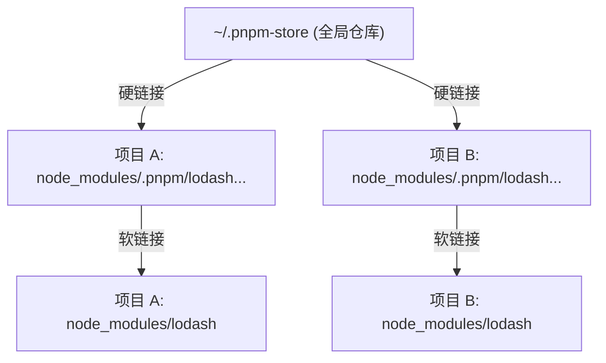

# pnpm add package 的流程详解

pnpm 的安装流程根据包是否已在项目中存在，分为“查锁安装”和“全新安装”两种模式。

## 1. 全新安装流程 (首次安装)
当你在项目中添加一个从未出现过的包时，pnpm 的执行逻辑如下：

1.  **查询注册表 (Registry Query)**：
    *   直接请求远程注册表（如 npmjs.org）获取包的版本元数据。
2.  **版本解析与获取哈希 (Resolution & Integrity)**：
    *   根据语义化版本（SemVer）选定版本，并获取该版本的内容完整性哈希值（`integrity`）。
3.  **查询全局存储 (Store Check)**：
    *   **关键步骤**：使用哈希值去 `~/.pnpm-store`（全局存储）中搜寻。
    *   **命中 (Cache Hit)**：如果该包在电脑上的其他项目安装过，直接进入链接阶段（极速）。
    *   **未命中 (Cache Miss)**：从注册表下载压缩包 -> 解压 -> 存入全局存储。
4.  **建立硬链接 (Hard Linking)**：
    *   从全局存储创建硬链接到项目的 `node_modules/.pnpm` 目录。
5.  **更新锁文件 (Update Lockfile)**：
    *   将该包的版本、依赖关系和哈希值记录到 `pnpm-lock.yaml`。

## 2. 查锁安装流程 (基于已有配置)
当你运行 `pnpm install` 或包信息已存在于锁文件中时：

1.  **解析锁文件 (Lockfile Analysis)**：
    *   读取 `pnpm-lock.yaml`，直接确定精确的版本和哈希值，跳过远程注册表查询。
2.  **索引查找 (Index Lookup)**：
    *   检查全局存储中是否存在该版本包的索引文件。
3.  **内容匹配与链接 (Linking)**：
    *   确认全局存储中有对应哈希的数据块。
    *   在项目的 `node_modules/.pnpm` 目录中创建硬链接。
4.  **构建虚拟存储 (Virtual Store Construction)**：
    *   在 `node_modules` 根目录创建符号链接（Symlinks），指向 `.pnpm` 中的真实包路径。

---

## 核心区别对比

| 环节 | 全新安装 (首次) | 查锁安装 (基于锁文件) |
| :--- | :--- | :--- |
| **元数据来源** | 远程注册表 (Registry) | 本地锁文件 (`pnpm-lock.yaml`) |
| **版本确定** | 动态计算 (SemVer) | 静态读取 (精确版本) |
| **全局存储复用** | 支持 (跨项目复用) | 支持 (跨项目复用) |
| **网络开销** | 较高 (需查元数据) | 极低 (除非 Store 中没有该包) |

## 3. 跨项目复用示例：从项目 A 到项目 B

假设项目 A 已经安装过 `lodash`，现在你在项目 B 中首次运行 `pnpm add lodash`，其流程如下：

1.  **版本查询**：项目 B 请求注册表，确定 `lodash` 的版本（如 `4.17.21`）及其哈希值。
2.  **全局存储匹配**：pnpm 拿着哈希值去 `~/.pnpm-store` 搜寻，发现项目 A 之前已经下载过该版本。
3.  **瞬间安装 (Instant Linking)**：
    *   **无需下载**：直接从全局存储创建**硬链接**到项目 B 的 `.pnpm` 目录。
    *   **极速完成**：由于只是系统层面的引用增加，耗时几乎为 0 毫秒。
4.  **建立访问路径**：在项目 B 的 `node_modules` 根目录创建**软链接**，指向项目 B 内部的 `.pnpm` 路径。

### 关系架构图

## 为什么 pnpm 更快？
*   **跨项目复用**：只要电脑上装过一次，所有项目都能瞬间复用。
*   **零复制安装**：通过硬链接而非复制文件，大幅减少磁盘 I/O 开销。
*   **严格隔离**：通过符号链接确保只有声明过的包才能被代码访问。

---
*本文由 GitHub Copilot 生成，基于对 pnpm 安装机制的深度解析。*
