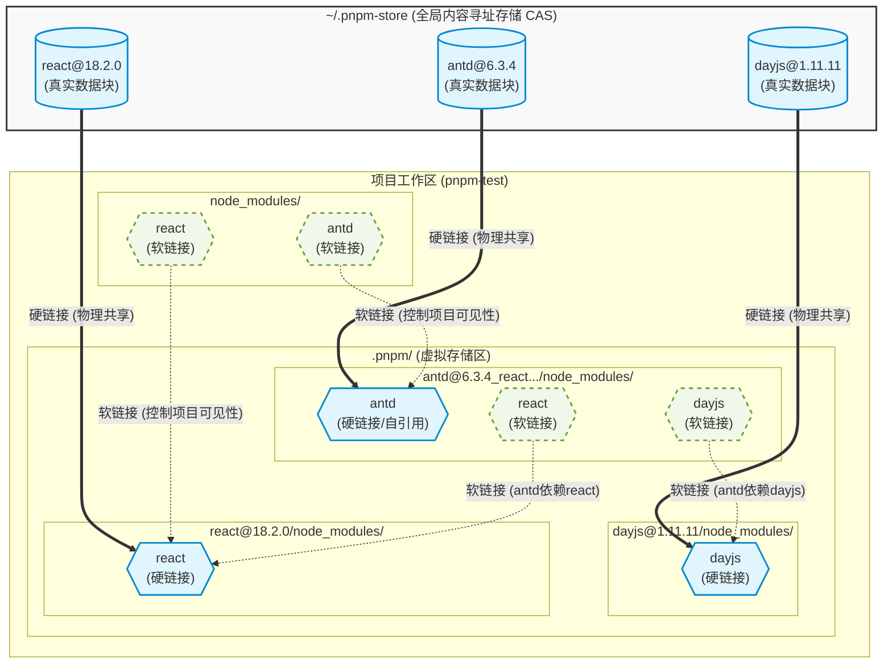

# pnpm 依赖存储与关联引用机制图解

本文档通过 Mermaid 架构图详细展示了 pnpm 是如何通过全局存储（CAS）、虚拟存储区（`.pnpm`）以及各种链接机制（硬链接与软链接）来管理项目依赖的。

## 机制图解

## 核心原理解析

1. **最上层（全局仓库）**：只存储真正的物理数据块，按内容寻址（CAS），确保全电脑只存一份相同的数据。
2. **中间层（虚拟存储区 `.pnpm`）**：
   * 通过 **硬链接** 从全局拉取数据（如 `antd(硬链接)`）。
   * 通过内部的 **软链接** 构建包与包之间的依赖树（如 `antd` 指向 `dayjs`）。
   * **自引用机制**：`antd` 在自己的目录下还有一个硬链接，用以利用 Node.js 模块查找逻辑并支持包的内部自引用。
3. **最下层（项目根目录 `node_modules`）**：仅包含在 `package.json` 中明确声明的依赖的 **软链接**。这严格控制了代码的可见性，杜绝了“幽灵依赖”问题。